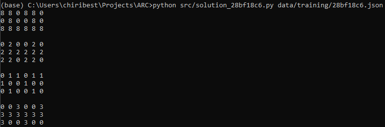

### Hand-coding solutions for ARC

#### Students:
* Praneeth Jakkaraju
* Tudor Chiribes
* Laura Gonzalez

#### Tasks solved:
* 28bf18c6.json
* 9565186b.json
* ea786f4a.json

This repository contains hand-coded solutions which generate the correct output for the above input files.

Each python script expects the path to the associated json file. They can therefore be ran from the command line as follows:

`python solution_9565186b.py ../data/training/9565186b.json`

Example output:

The grids are printed out row-by-row with unpacked lists of numbers. Where the computed solution grid does not match the one from the training/testing pairs, a 'Solution is wrong!' message is printed instead.
